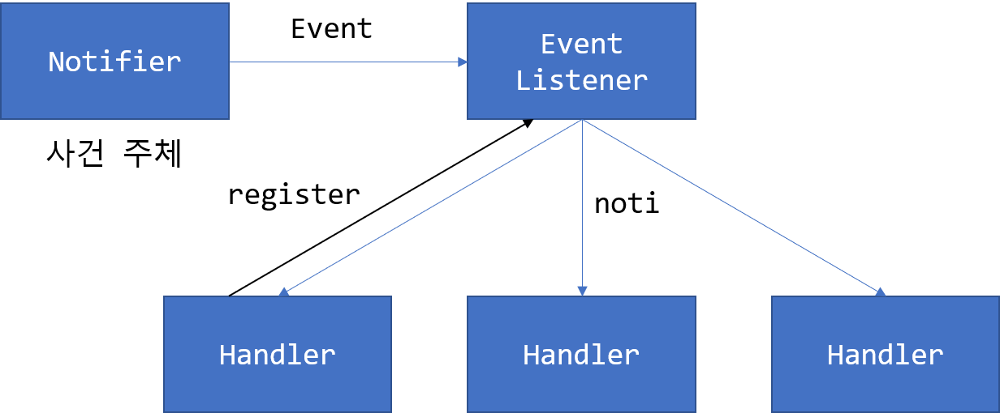

# 웹 프론트 기초


## HTML

html은 markup language입니다. markup language는 선언형 명령으로 볼 수 있다.

아래는 가장 간단한 html 파일입니다.
```html
<!DOCTYPE html>
<html>
  <head>

  </head>
  <body>
    <h1>My First Heading</h1>
    <p>My first paragraph.</p>
  </body>
</html>
```

- `<!DOCTYPE html>`: HTML5 선언
- `<html>`: html 문서라는 것을 선언
- `<head>`: head 부분인 것을 선언, title, javascript, css, 메터정보 등이 들어갑니다.
- `<body>`: body 부분인 것을 선언, 실제 html 구조를 표현합니다.


### Element

꺽쇠 안에 들어있는 지시작를 html에서는 `element`라고 부른다. html에서 `element`들은 각각의 역할이 정해져 있습니다. 간혹 `tag`라고도 부릅니다.

예)
- `<html>`
- `<body>`
- `<div>`
- `<a>`
- ``


### 자주 쓰이는 element

#### `div`

html의 블럭을 나눌때 사용합니다. (미니 body라고 생각하면 편리합니다.)


#### `h1`

header, 제목을 장식할때 사용합니다. h1 이외에 h1 ~ h6R 까지 존재합니다.

#### `p`

문단을 나눌때 사용합니다.

#### `img`

이미지 사용

#### `ul` & `ol`

리스트 사용

- `ul`: unordered list: 동그라미로 표시
- `ol`: ordered list: 숫자로 표시

### Attribute

element의 특징을 표현하는 부분입니다. 가장 대표적인 예로 `href`가 있습니다. 혹은 `src` attribute도 있습니다.

```html
<a href="https://naver.com"></a>


```

### 중요 attribute

#### `id`

특정 element를 참조하기 위해서 명시적으로 id 값을 부여합니다. 나중에 javascript에서 특정 id값으로 찾아 낼 수 있습니다. id는 html 파일 안에서 unique해야 합니다.


#### `class`

css style 적용을 하기 위해서 자주 사용하는 attribute입니다. grouping을 하기 위해서 자주 사용됩니다.


## CSS


### inline 형식
css는 attribute 중에 style 이라는 부분에서 작동하는 메커니즘입니다. 주로 시각적 요소를 표현하기 위한 용도로 많이 사용됩니다.

```html
<h1 style="color:blue;">This is a Blue Heading</h1>
```

### internal 형식

아래와 같이 `head` 부분에서 선언할 수도 있습니다.

```html
<!DOCTYPE html>
<html>
  <head>
    <style>
      body {background-color: powderblue;}
      h1   {color: blue;}
      p    {color: red;}
    </style>
  </head>
  <body>

    <h1>This is a heading</h1>
    <p>This is a paragraph.</p>

  </body>
</html>
```

### external 형식

혹은 아예 외부로 빼낼 수 있습니다.

```html
<!DOCTYPE html>
<html>
  <head>
    <link rel="stylesheet" href="styles.css">
  </head>
  <body>

    <h1>This is a heading</h1>
    <p>This is a paragraph.</p>

  </body>
</html>

```

### CSS 사용법

#### element css 적용

```html
p {
  border: 1px solid powderblue;
}


<p>abc</p>
```

#### id를 참조하여 css 적용

```html
#myid {
  border: 1px solid powderblue;
}

<p id="myid">abc</p>
```

#### class를 참조하여 css 적용

```html
.myclass {
  border: 1px solid powderblue;
}


<p class="myclass">abc</p>
```

*html은 결국 element와 attribute가 각각 어떤 역할을 하는지 파악해 나가는 싸움입니다.*

## javascript

```html
<!DOCTYPE html>
<html>
  <head>
    <script>
      document.getElementById("demo").innerHTML = "My First JavaScript";
    </script>
  </head>
  <body>

    <h1>This is a heading</h1>
    <p>This is a paragraph.</p>

  </body>
</html>
```

javascript는 단지 html, css의 element와 attribute를 *동적으로* 추가, 수정, 삭제해주는 역할을 담당합니다.


### 호출 순서

html 파일은 항상 위에서부터 아래로 실행됩니다. javascript 파일이 아래에 있던지 onload 이벤트를 구현해야 합니다.

### Event Driven Architecture

혹은 Observer pattern라고도 불립니다.

- Notifier 혹은 Trigger: 어떠한 이벤트를 일으키는 주체
- (Event) Listener 혹은 Topic: 특정 이벤트에 귀 기울이고 있는 컴포넌트
- Handler 혹은 Callback: 특정 동작을 하는 컴포넌트
- Event: 이벤트 자체




### :trophy: Do it more

파이썬으로 Observer pattern을 구현해 봅시다.


### ajax

Asynchronous JavaScript and XML의 약자, 비동기 서버 통신 객체


